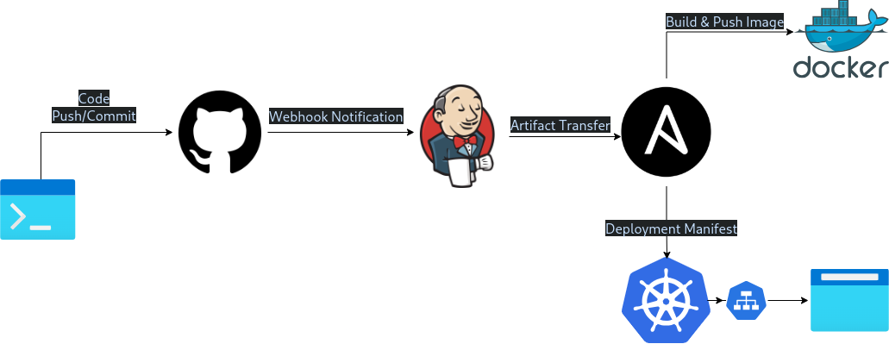

# 📄 Project Overview

This project automates the deployment process of a web application using a CI/CD pipeline built with GitHub Webhooks, Jenkins, Ansible, Docker, and Kubernetes. The goal is to simulate a complete deployment workflow without relying on cloud services like AWS, using Docker containers to replicate a real-world environment.

Here’s how the flow works:

**Developer Interaction:** A developer pushes code or performs actions (e.g., commits, merges) to a GitHub repository.

**GitHub Webhook Trigger:** The repository is configured with a GitHub Webhook. A webhook is a lightweight notification mechanism that sends an **HTTP** **POST** request to a predefined URL when specified events occur (e.g., push, pull_request). Unlike GitHub Actions, which run workflows directly in GitHub, webhooks only notify external services like Jenkins to perform actions.

**Jenkins CI:** Jenkins receives the webhook notification and triggers a pipeline job. Jenkins then clones the repository onto its workspace.

**File Transfer to Ansible Server:** Jenkins copies the cloned repository to a separate Ansible server. This server is responsible for image creation and deployment logic.

**Docker Build & Push:** The Ansible server uses Docker to build, tag, and push the application image to a container registry. Docker must be installed and configured on this server.

**Deployment to Kubernetes:** The Ansible server copies the necessary deployment files to the Kubernetes cluster server. Then, using kubectl, it applies the manifests to deploy the application.

**Web Access:** Once deployed, the application is exposed and can be accessed through a web browser via a Kubernetes service (e.g., LoadBalancer or NodePort).

Due to AWS Free Tier limitations, this project avoids using AWS services and instead relies entirely on Docker containers to simulate the servers and environment.

## 🔗 Setting Up the GitHub Webhook

To begin, I needed to create a **GitHub Webhook** for the repository. This can be done by navigating to:
```
Repository Settings → Webhooks → Add Webhook
```

GitHub webhooks require a Payload URL — this is the endpoint where GitHub will send POST requests whenever the configured events occur (e.g., push, pull_request). Since I'm working from a local development environment, hosting a public-facing URL is not straightforward.

I initially considered using my public IP address, but this approach doesn't work reliably. Most home networks share a single public IP across all connected devices, and without proper port forwarding and DNS setup, GitHub won’t be able to reach the specific machine hosting the server.

To solve this, I used tunneling tools that expose local servers to the internet securely. I explored several options:

- Ngrok (originally open-source, now closed-source with a freemium model)

- LocalTunnel

- Cloudflare Tunnel

- Tunnelmole

I chose **Ngrok** for this setup. Here's what I did:

Visited ngrok.com and downloaded the CLI tool.

Installed and authenticated it using my authtoken.

Started a tunnel pointing to the local Jenkins server (or whichever service you’re exposing).

Ngrok provided a public URL (e.g., https://abc123.ngrok.io) which I used as the Payload URL in the GitHub Webhook configuration.
